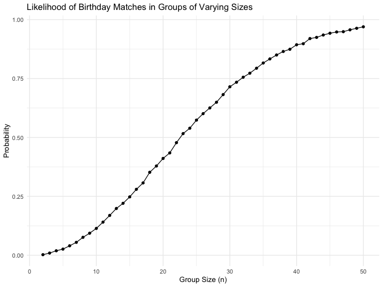

P8105 Homework 5
================
2024-11-14

Name: Xi Peng Uni: xp2213

# Problem 1. Birthday problem

``` r
bday_sim = function(n) {
  
      bdays = sample(1:365, size = n, replace = TRUE)
      
      duplicate = length(unique(bdays)) < n

      return(duplicate)
      
}

bday_sim(100)
```

    ## [1] TRUE

``` r
sim_res =
  expand_grid(
    n = 2:50,
    iter = 1:10000
  ) |> 
  mutate(res = map_lgl(n,bday_sim)) |> 
  group_by(n) |> 
  summarize(probability = mean(res))

sim_res |> 
  ggplot(aes(x = n, y = probability)) +
  geom_line()
```

<!-- -->

The plot shows that the probability of at least two people sharing a
birthday increases steadily as the group size grows. At around the
sample size of 23 people, the probability crosses the 0.5 mark,
representing a key threshold. Beyond this point, the probability
approaches 1 as the group size exceeds 50.
