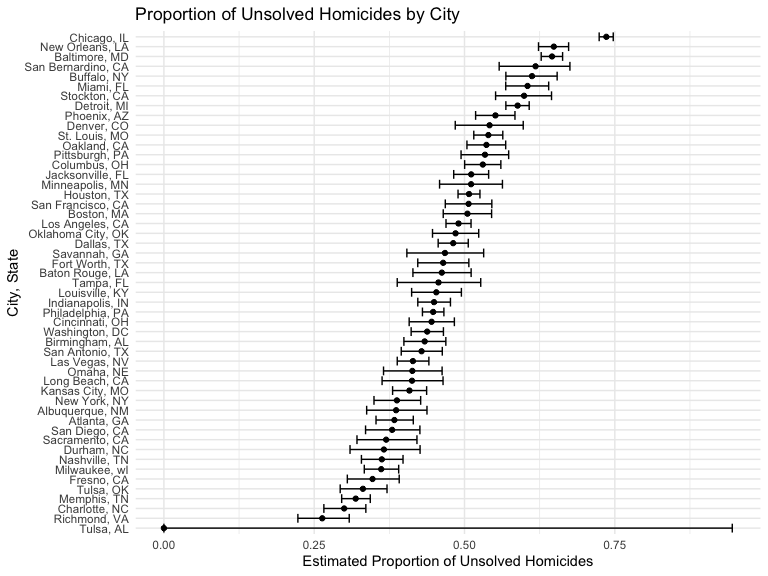

P8105 Homework 5
================
2024-11-14

Name: Xi Peng Uni: xp2213

# Problem 1. Birthday problem

Defines the bday_sim function, which simulates random birthdays for a
group of size n and checks if there are any duplicate birthdays,
returning TRUE if duplicates exist and FALSE otherwise.

``` r
bday_sim = function(n) {
  
      bdays = sample(1:365, size = n, replace = TRUE)
      
      duplicate = length(unique(bdays)) < n

      return(duplicate)
      
}
```

Runs the bday_sim function 10,000 times for each group size from 2 to
50, calculates the probability of at least two people sharing a
birthday, and plots this probability as a function of group size.

``` r
sim_res =
  expand_grid(
    n = 2:50,
    iter = 1:10000
  ) |> 
  mutate(res = map_lgl(n,bday_sim)) |> 
  group_by(n) |> 
  summarize(probability = mean(res))

sim_res |> 
  ggplot(aes(x = n, y = probability)) +
  geom_line() +
  geom_point() +
  labs (
    title = "Likelihood of Birthday Matches in Groups of Varying Sizes",
    x = "Group Size (n)",
    y = "Probability"
  )
```


The plot shows that the probability of at least two people sharing a
birthday increases steadily as the group size grows. At around the
sample size of 23 people, the probability crosses the 0.5 mark,
representing a key threshold. Beyond this point, the probability
approaches 1 as the group size exceeds 50.

# Problem 2. Power Analysis of a One-Sample T-test

Defines a t_test_sim function and perform a one-sample t-test.

``` r
alpha = 0.05

t_test_sim = function(mu) {
  
  x = rnorm(30, mean = mu, sd = 5)
  
  t_test_res = t.test(x, mu = 0) |> 
    broom::tidy() |> 
    select(estimate, p.value)
  
  return(t_test_res)
}

# Simulates data for mu = 0 across 5000 iterations, performs t-tests, and calculates whether the null hypothesis is rejected based on the alpha level.
sim_res_0 = 
  expand_grid(
    mu = 0,
    iter = 1:5000
  ) |> 
  mutate(
    test_res = map(mu, t_test_sim)
  ) |>
  unnest(test_res) |>
  mutate(
    rejected = p.value < alpha
  )

# Repeat the above for μ = {1,2,3,4,5,6}.
sim_res_1_6 = 
  expand_grid(
    mu = c(1, 2, 3, 4, 5, 6),
    iter = 1:5000
  ) |> 
  mutate(
    test_res = map(mu, t_test_sim)
  ) |>
  unnest(test_res) |>
  mutate(
    rejected = p.value < alpha
  )

# Combine results from μ = 0 and μ = {1,2,3,4,5,6} simulations into a single dataset for further analysis.
sim_res_comb = bind_rows(sim_res_0, sim_res_1_6)

sim_q2_summary_df = sim_res_comb |> 
  group_by(mu) |>
  summarise(
    power = mean(rejected),
    avg_estimate = mean(estimate),
    avg_estimate_rejected = mean(estimate[rejected])
  ) 
```

Create a plot illustrating how the power of the test varies with the
true value of the mean (μ).

``` r
power_plot = 
  sim_q2_summary_df  |>
  ggplot(aes(x = mu, y = power)) +
  geom_line() +
  geom_point() +
  labs(
    x = "True value of μ",
    y = "Power of test",
    title = "Effect Size and Power"
  )

power_plot
```


Creates a plot comparing the average estimate of μ across all samples
with the average estimate of μ only for samples where the null
hypothesis was rejected.

``` r
estimates_plot =
  sim_q2_summary_df |>
  ggplot(aes(x = mu)) +
  geom_point(aes(y = avg_estimate, color = "All samples")) +
  geom_line(aes(y = avg_estimate, color = "All samples")) +
  geom_point(aes(y = avg_estimate_rejected, color = "Rejected null only")) +
  geom_line(aes(y = avg_estimate_rejected, color = "Rejected null only")) +
  labs(
    x = "True value of μ",
    y = "Average estimate of μ",
    title = "Average Estimates vs True μ",
    color = "Sample Type"
  )

estimates_plot
```


There is a clear association between effect size and power. When the
true value of μ is small, the test has low power, meaning there is a
smaller chance of rejecting the null hypothesis. However, as μ
increases, representing a larger effect size, the power of the test also
increases. Specifically, according to the the “Effect Size and Power”
plot, from μ = 1 to μ = 3, the power rises sharply. Beyond μ = 4, the
power approaches 1, indicating that the test is highly effective at
detecting a false null hypothesis at these larger effect sizes.

The sample average of 𝜇̂ across tests for which the null is rejected is
not exactly equal to the true value ofμu.

# Problem 3. Homicide Rates Across U.S. Cities

Dataset import and clean.

``` r
url = "https://raw.githubusercontent.com/washingtonpost/data-homicides/refs/heads/master/homicide-data.csv"

homi_data = read_csv(url)
```

    ## Rows: 52179 Columns: 12
    ## ── Column specification ────────────────────────────────────────────────────────
    ## Delimiter: ","
    ## chr (9): uid, victim_last, victim_first, victim_race, victim_age, victim_sex...
    ## dbl (3): reported_date, lat, lon
    ## 
    ## ℹ Use `spec()` to retrieve the full column specification for this data.
    ## ℹ Specify the column types or set `show_col_types = FALSE` to quiet this message.

``` r
homi_data2 = homi_data |> 
  janitor::clean_names() |> 
  mutate(
    city_state = str_c(city, ", ", state)
  )

total_vs_unsolve = homi_data2 |> 
    group_by(city) |> 
  summarize(
    Total_homicides = n(),
    Unsolved_homicides = sum(disposition %in% c("Closed without arrest", "Open/No arrest"))
  )
```

The raw data contains 12 variables, which are uid, reported_date,
victim_last, victim_first, victim_race, victim_age, victim_sex, city,
state, lat, lon, disposition, and 52179 observations.Each observation is
uniquely identified by a uid and includes the reported date of the
incident, as well as the victim’s full name, age, sex, and race.
Location details such as latitude, longitude, city, and state are also
provided, along with the final disposition of the case. In the tidy
dataset, a new variable, city_state, was created by combining city and
state to simplify geographic analysis.

<br> Calculate the total and unsolved homicides in Baltimore, MD and
perform a proportion test to estimate the proportion of unsolved
homicides along with confidence intervals.

``` r
Bal_MD_prop = homi_data2 |> 
  filter(city_state == "Baltimore, MD") |> 
  summarize(
    Total_Homicides_in_Baltimore_MD = n(),
    Unsolved_Homicides_in_Baltimore_MD = sum(disposition %in% c("Closed without arrest", "Open/No arrest"))
  )

Bal_MD_prop_res = prop.test(Bal_MD_prop$Unsolved_Homicides_in_Baltimore_MD, Bal_MD_prop$Total_Homicides_in_Baltimore_MD) |> 
  broom::tidy() |> 
  select(estimate,conf.low, conf.high)

knitr::kable(Bal_MD_prop_res, caption = "Proportion of Unsolved Homicides in Baltimore, MD")
```

|  estimate |  conf.low | conf.high |
|----------:|----------:|----------:|
| 0.6455607 | 0.6275625 | 0.6631599 |

Proportion of Unsolved Homicides in Baltimore, MD

Extract both the proportion of unsolved homicides and the confidence
interval for each of the cities.

``` r
homicide_rate_by_cities = function(city_name) {
  
  city = homi_data2 |> 
    filter(city_state == city_name) |> 
  summarize(
    Total_Homicides = n(),
    Unsolved_Homicides = sum(disposition %in% c("Closed without arrest", "Open/No arrest"))
  )
  
  prop_res = prop.test(city$Unsolved_Homicides, city$Total_Homicides) |> 
    broom::tidy() |> 
    select(estimate,conf.low, conf.high)
  
  return(prop_res)
}

all_cities_states = unique(homi_data2$city_state)

homi_summary = tibble(
  city_state = all_cities_states,
  res = map(all_cities_states, homicide_rate_by_cities)
) |> 
  unnest(res)

knitr::kable(homi_summary, caption = "Proportion of Unsolved Homicides Across U.S. Cities")
```

| city_state         |  estimate |  conf.low | conf.high |
|:-------------------|----------:|----------:|----------:|
| Albuquerque, NM    | 0.3862434 | 0.3372604 | 0.4375766 |
| Atlanta, GA        | 0.3833505 | 0.3528119 | 0.4148219 |
| Baltimore, MD      | 0.6455607 | 0.6275625 | 0.6631599 |
| Baton Rouge, LA    | 0.4622642 | 0.4141987 | 0.5110240 |
| Birmingham, AL     | 0.4337500 | 0.3991889 | 0.4689557 |
| Boston, MA         | 0.5048860 | 0.4646219 | 0.5450881 |
| Buffalo, NY        | 0.6122841 | 0.5687990 | 0.6540879 |
| Charlotte, NC      | 0.2998544 | 0.2660820 | 0.3358999 |
| Chicago, IL        | 0.7358627 | 0.7239959 | 0.7473998 |
| Cincinnati, OH     | 0.4452450 | 0.4079606 | 0.4831439 |
| Columbus, OH       | 0.5304428 | 0.5002167 | 0.5604506 |
| Dallas, TX         | 0.4811742 | 0.4561942 | 0.5062475 |
| Denver, CO         | 0.5416667 | 0.4846098 | 0.5976807 |
| Detroit, MI        | 0.5883287 | 0.5687903 | 0.6075953 |
| Durham, NC         | 0.3659420 | 0.3095874 | 0.4260936 |
| Fort Worth, TX     | 0.4644809 | 0.4222542 | 0.5072119 |
| Fresno, CA         | 0.3470226 | 0.3051013 | 0.3913963 |
| Houston, TX        | 0.5074779 | 0.4892447 | 0.5256914 |
| Indianapolis, IN   | 0.4493192 | 0.4223156 | 0.4766207 |
| Jacksonville, FL   | 0.5111301 | 0.4820460 | 0.5401402 |
| Kansas City, MO    | 0.4084034 | 0.3803996 | 0.4370054 |
| Las Vegas, NV      | 0.4141926 | 0.3881284 | 0.4407395 |
| Long Beach, CA     | 0.4126984 | 0.3629026 | 0.4642973 |
| Los Angeles, CA    | 0.4900310 | 0.4692208 | 0.5108754 |
| Louisville, KY     | 0.4531250 | 0.4120609 | 0.4948235 |
| Memphis, TN        | 0.3190225 | 0.2957047 | 0.3432691 |
| Miami, FL          | 0.6048387 | 0.5685783 | 0.6400015 |
| Milwaukee, wI      | 0.3614350 | 0.3333172 | 0.3905194 |
| Minneapolis, MN    | 0.5109290 | 0.4585150 | 0.5631099 |
| Nashville, TN      | 0.3624511 | 0.3285592 | 0.3977401 |
| New Orleans, LA    | 0.6485356 | 0.6231048 | 0.6731615 |
| New York, NY       | 0.3875598 | 0.3494421 | 0.4270755 |
| Oakland, CA        | 0.5364308 | 0.5040588 | 0.5685037 |
| Oklahoma City, OK  | 0.4851190 | 0.4467861 | 0.5236245 |
| Omaha, NE          | 0.4132029 | 0.3653146 | 0.4627477 |
| Philadelphia, PA   | 0.4478103 | 0.4300380 | 0.4657157 |
| Phoenix, AZ        | 0.5514223 | 0.5184825 | 0.5839244 |
| Pittsburgh, PA     | 0.5340729 | 0.4942706 | 0.5734545 |
| Richmond, VA       | 0.2634033 | 0.2228571 | 0.3082658 |
| San Antonio, TX    | 0.4285714 | 0.3947772 | 0.4630331 |
| Sacramento, CA     | 0.3696809 | 0.3211559 | 0.4209131 |
| Savannah, GA       | 0.4674797 | 0.4041252 | 0.5318665 |
| San Bernardino, CA | 0.6181818 | 0.5576628 | 0.6753422 |
| San Diego, CA      | 0.3796095 | 0.3354259 | 0.4258315 |
| San Francisco, CA  | 0.5067873 | 0.4680516 | 0.5454433 |
| St. Louis, MO      | 0.5396541 | 0.5154369 | 0.5636879 |
| Stockton, CA       | 0.5990991 | 0.5517145 | 0.6447418 |
| Tampa, FL          | 0.4567308 | 0.3881009 | 0.5269851 |
| Tulsa, OK          | 0.3310463 | 0.2932349 | 0.3711192 |
| Tulsa, AL          | 0.0000000 | 0.0000000 | 0.9453792 |
| Washington, DC     | 0.4379182 | 0.4112495 | 0.4649455 |

Proportion of Unsolved Homicides Across U.S. Cities

Create a plot displaying the estimated proportion of unsolved homicides
across various U.S. cities, with each point representing the mean
estimate and error bars indicating 95% confidence intervals.

``` r
homi_rate_plot = homi_summary |> 
  mutate(city_state = reorder(city_state, estimate)) |> 
  ggplot(aes(x = city_state, y = estimate)) +
  geom_point() +
  geom_errorbar(aes(ymin = conf.low, ymax = conf.high)) +
  labs(
    title = "Proportion of Unsolved Homicides by City",
    x = "City, State",
    y = "Estimated Proportion of Unsolved Homicides"
  ) +
  coord_flip() 

homi_rate_plot
```


